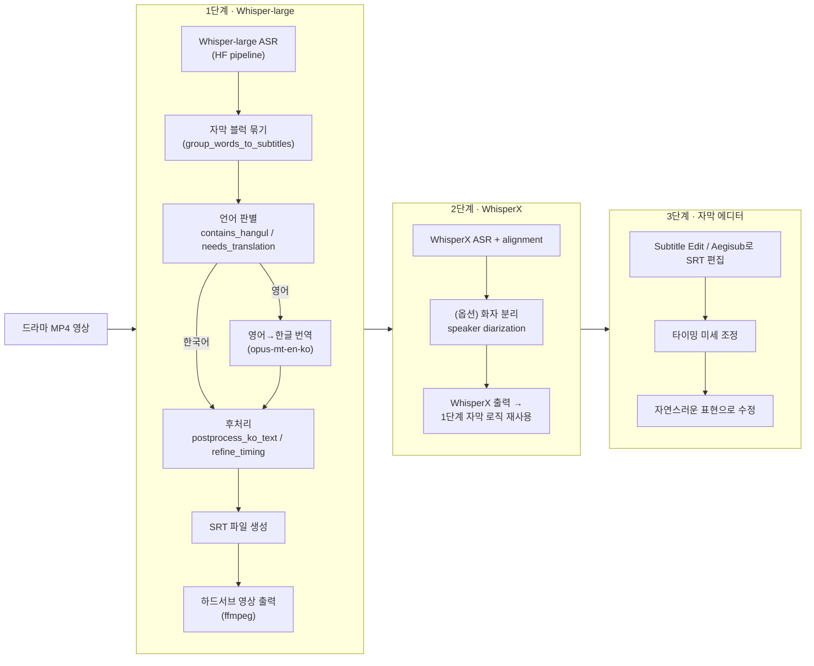
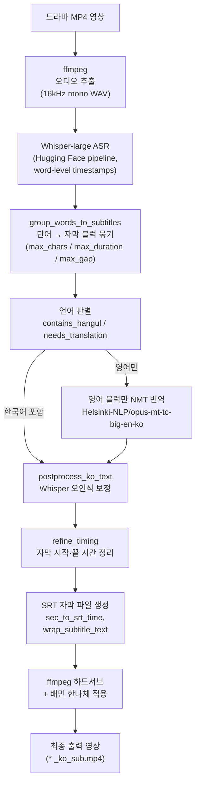
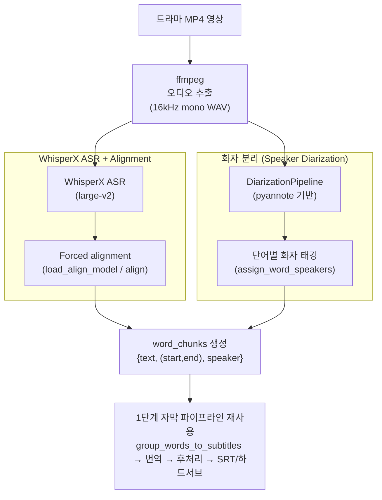

## 🎬 AI 영상 컨텐츠 자동 자막 생성 파이프라인 프로젝트 3단계 로드맵


## 📚 AI 영상 컨텐츠 자동 자막 생성 파이프라인 프로젝트 3단계 요약

### 1단계: 기본 Whisper-large 파이프라인

- `openai/whisper-large` + Hugging Face `pipeline` 기반 ASR
- word-level 타임스탬프를 이용한 자막 블럭 생성
- 영어 대사만 NMT(`Helsinki-NLP/opus-mt-tc-big-en-ko`)로 번역
- 간단한 문자열 치환(`postprocess_ko_text`)으로 자주 틀리는 표현 보정
- `refine_timing`으로 첫 자막 시점, 최대 표시 시간, 자막 간 간격 조정
- 결과물을 SRT + FFmpeg 하드서브 영상으로 출력

### 2단계: WhisperX 기반 정밀 alignment + 화자 정보 활용

- Whisper 대신 **WhisperX**를 사용해 더 정교한 타임스탬프와 alignment 확보
- 필요 시 화자 분리(speaker diarization)를 적용해,
  자막에 화자 정보를 반영할 수 있는 구조로 확장
- 1단계에서 구현한 자막 블럭/번역/후처리 로직을 WhisperX 출력으로 재사용

### 3단계: 자막 에디터를 통한 수작업 후반 작업

- Subtitle Edit, Aegisub 등의 자막 편집 도구로 SRT를 불러와:
  - 미묘한 타이밍 조정
  - 표현 자연스럽게 다듬기
  - 컷 전환/회상 장면 등에 맞춘 세밀한 연출
- 최종적으로 OTT/극장 수준의 자막 퀄리티를 목표로 하는 단계
<br><br>

## 🔍 AI 기반 드라마 자동 자막 생성 파이프라인 1단계 로드맵



# 🎬 AI 기반 드라마 자동 자막 생성 파이프라인 1단계 요약

## 1. 프로젝트 개요

이 프로젝트는 **드라마 영상의 음성을 자동으로 인식하고, 한국어/영어 발화를 모두 한국어 자막으로 변환**한 뒤,  
FFmpeg를 이용해 영상에 자막을 입히는 end-to-end 파이프라인입니다.

- 대상 콘텐츠: 디즈니플러스 오리지널 드라마 **조각도시** 일부 클립 (약 4분 2초)
- 언어 환경: 한국어 + 영어 혼재
- 목표:
  - 한국어 발화는 그대로 받아쓰기
  - 영어 발화는 **영어 → 한국어 번역** 후 자막 생성
  - 영화관/OTT에 가까운 자연스러운 자막 타이밍과 길이 구현

---

## 2. 사용 기술 및 모델

### 2.1 음성 인식 (ASR: Automatic Speech Recognition)

- **모델:** `openai/whisper-large` (Hugging Face Transformers)
- **구조:** Transformer 기반 encoder-decoder
- **학습 데이터:** 약 68만 시간 규모의 다국어 음성 데이터
- **선택 이유:**
  - 한국어와 영어가 섞인 환경에서 동작하는 **멀티링구얼 모델**
  - small, medium, large 세 가지 모델을 비교 실험한 결과,  
    large 모델이 고유명사/전문 용어 등에서 가장 안정적인 정확도를 보여 최종 선택

ASR 결과는 **word-level 타임스탬프**(`return_timestamps="word"`)로 얻어,  
단어 단위로 자막 블럭을 구성하는 데 활용합니다.

---

### 2.2 Whisper 모델 크기별 실험 결과

이 프로젝트에서는 동일한 파이프라인에 대해  
`whisper-small`, `whisper-medium`, `whisper-large`를 모두 테스트해 보고,  
각 모델에서 반복적으로 등장하는 **오인식 패턴을 직접 눈으로 확인**한 뒤  
후처리 함수(`postprocess_ko_text`)에 반영했습니다.

---

##### 🟡 whisper-small

- **장점**
  - 가장 가볍고 빠름 (Colab에서 테스트/디버깅용으로 좋음)
- **단점 (실제 실험에서 관찰된 오인식 예시들)**
  - `"빨라고"` → **"팔로우"**
  - `"혼법"` → **"헌법"**
  - `"의미인"` → **"의문"**
  - `"갖다는"` → **"갔다는"**
  - `"페이지아이"` → **"피해자의"**
  - `"행정구에게"` → **"행정구역에"**
  - `"서유"` → **"소요"**
  - `"비되면"` → **"비대면"**
  - `"감시"` → **"감식"**
  - `"이입"` → **"이의있"**
  - `"지키지"` → **"찍히지"**
  - `"사각지 들으면"` → **"사각지대로만"**
  - `"피고치게 이해"` → **"피고측의 이의에"**
  - `"피지"` → **"피의자"**
  - `"알려가지고"` → **"하셔가지고"**

→ 법률 문맥/고유명사에서 오인식이 많이 발생해,  
이때는 `fixes = { "빨라고": "팔로우", ... }` 형태의 치환 규칙을 많이 사용해야 했습니다.

---

##### 🟡 whisper-medium

- **장점**
  - small 대비 전체적인 의미 정확도가 향상
  - 일상적인 표현은 꽤 안정적으로 인식
- **단점 (실제 실험에서 관찰된 오인식 예시들)**
  - `"의미점"` → **"의문점"**
  - `"PHI"` → **"피해자"**
  - `"철문희"` → **"젊은이"**
  - `"하셔서요"` → **"하셔가지고요"**
  - `"감시"` → **"감식"**
  - `"예 있습니다"` → **"이의 있습니다"**
  - `"지키지"` → **"찍히지"**
  - `"이해"` → **"이의에"**
  - `"하려가지고"` → **"하셔가지고"`

→ small보다는 낫지만, 여전히 법정/진술 장면처럼 발음이 비슷한 단어들이 섞인 경우  
수동 후처리 규칙이 꽤 많이 필요했습니다.

---

##### 🟡 whisper-large (최종 선택)

- **장점**
  - 테스트한 세 모델 중 **가장 높은 인식 정확도**
  - 특히 법률 용어, 고유명사, 긴 문장에서도 사람이 보기 자연스러운 결과
- **남아 있던 대표적인 오인식 예시**
  - `"PHI"` → **"피해자의"**
  - `"피고 측에 의해"` → **"피고측의 이의에"`

→ large 모델에서는 small/medium에서 필요했던 대부분의 규칙이 불필요해졌고,  
최종 코드의 `postprocess_ko_text()`에는 아래와 같이 **최소한의 보정만** 남겼습니다.

```python
fixes = {
    "PHI": "피해자의",
    "피고 측에 의해": "피고측의 이의에",
}
```

---

### 2.3 기계 번역 (NMT: Neural Machine Translation)

- **모델:** `Helsinki-NLP/opus-mt-tc-big-en-ko`
- **방향:** 영어 → 한국어
- **구조:** Transformer-big
- **학습 데이터:** OPUS 영어–한국어 병렬 말뭉치

텍스트에 대해:

- 한글이 포함되어 있으면 → **번역하지 않고 그대로 사용**
- 한글은 없고 알파벳만 있으면 → 영어라고 판단하고 번역

하는 간단한 규칙을 사용합니다.

---

## 3. 전체 파이프라인

1. **mp4 → wav 추출**
   - ffmpeg로 원본 mp4에서 오디오만 추출
   - Whisper 권장 포맷인 **16kHz, mono, 16-bit PCM**으로 변환

2. **Whisper-large ASR (word-level timestamps)**
   - `pipeline("automatic-speech-recognition", return_timestamps="word")`
   - 결과: 전체 텍스트 + 단어별 `(start, end, text)` 리스트

3. **단어들을 자막 블럭으로 그룹핑**
   - `group_words_to_subtitles` 함수
   - 기준:
     - 자막 한 블럭 최대 글자 수
     - 자막 한 블럭 최대 시간 길이
     - 단어 사이 침묵 시간

4. **영어만 번역 + 한국어 후처리**
   - `needs_translation`으로 “영어인지?” 판별
   - 영어인 블럭만 Hugging Face 번역 파이프라인에 통과
   - Whisper가 자주 틀리는 표현들은 `postprocess_ko_text`에서 문자열 치환으로 보정  
     (예: `"PHI" → "피해자의"`, `"피고 측에 의해" → "피고측의 이의에"` 등)

5. **문장 단위 병합 + 타이밍 정리**
   - `merge_subtitles_by_sentence`
     - 문장이 어색하게 끊긴 블럭을 다시 합치기
   - `refine_timing`
     - 첫 자막이 영상 시작과 너무 겹치지 않도록 보정
     - 자막 한 블럭이 너무 오래 남지 않도록 최대 표시 시간 제한
     - 이전/다음 자막 간의 최소 간격 확보

6. **SRT 파일 생성**
   - `sec_to_srt_time`으로 초 → `HH:MM:SS,mmm` 형식 변환
   - `wrap_subtitle_text`로 긴 문장을 1~2줄로 적당히 나눔
   - `save_srt`로 표준 SRT 형식 파일 (`.srt`) 저장

7. **FFmpeg로 하드서브(hard subtitle) 영상 출력**
   - `subtitles=...:force_style=...` 필터 사용
   - 배달의민족 **한나체 Air(BM Hanna Air)** 폰트를 적용해 시각적 완성도 향상
   - 최종 결과: `drama_themanupulated_4m2s_ko_sub.mp4`

---

## 4. 환경 요구 사항

- 실행 환경: Google Colab (GPU 런타임 추천)
- 주요 라이브러리:
  - `torch`
  - `transformers`
  - `accelerate`
  - `sentencepiece`
  - `huggingface_hub`
  - `ffmpeg` (시스템 패키지)
  - (선택) `moviepy`, `librosa`

---

## 5. 사용 방법 (Colab 기준)

1. 이 리포지토리를 클론하거나, 노트북(`.ipynb`)을 Colab에 업로드합니다.
2. Colab 런타임 유형을 **GPU**로 설정합니다.
3. 노트북 상단의 **환경 세팅 셀**을 위에서부터 차례대로 실행합니다.
4. 원본 드라마 클립(mp4)을 Google Drive의 지정 경로에 업로드합니다.
5. ASR, 번역, SRT 생성, FFmpeg 하드서브까지 순서대로 실행합니다.
6. 최종 결과 영상(`*_ko_sub.mp4`)은 Google Drive에 저장되며,  
   다운로드하여 재생하면 한국어 자막이 입혀진 영상을 확인할 수 있습니다.

---

## 6. 실험 기록

- Whisper-small / medium / large 모델 비교 실험
  - small: 가볍고 빠르지만, 고유명사/전문 용어에서 오인식이 빈번
  - medium: 정확도 개선, 속도/메모리 타협형
  - **large: 가장 높은 정확도, 특히 법정/진술과 같은 긴 문장에서 안정적**
- 실제 사용 데이터(조각도시 일부 클립)를 기반으로
  - 자주 틀리는 표현들을 수동으로 수집하여 `postprocess_ko_text`에 반영
  - 자막 타이밍/길이를 반복 튜닝하여 OTT 스타일에 가까운 형태로 조정

---

## 7. 라이선스
- 데이터/영상: 원본 드라마 및 관련 콘텐츠의 저작권은 해당 제작사/플랫폼에 있음

---

## 8. 한계와 향후 개선 방향

- 현재는 Whisper 기본 타임스탬프만 사용하고 있어,
  - 회상 장면, 카메라 전환 등 **씬 단위 구조**를 완전히 이해하지는 못함
  - 단순히 글자수, 시간, 침묵 기준으로만 묶기 때문에 문법이나 조사가 끊기지 않도록 "문맥적"으로 이해
  하지 못하고 있음.

- 향후 개선 아이디어:
  - WhisperX와 같은 **forced alignment 도구** 적용
  - 캐릭터별 화자 분리(Speaker Diarization)를 추가해, 인물별 자막 컬러/위치 차별화
  - GUI 도구(예: Streamlit)로 웹 상에서 업로드 → 자막 생성까지 한 번에 처리하는 서비스 형태로 확장

---

## 9. 결과물 확인
✅ [결과물 바로가기](https://vimeo.com/1140345041?fl=tl&fe=ec)
<br><br><br><br><br>


## 🔍 AI 기반 드라마 자동 자막 생성 파이프라인 2단계 로드맵


# 🎬 AI 기반 드라마 자동 자막 생성 파이프라인 2단계 요약<br>

### 🟪 Whisper X 기반 alignment + 화자 정보 활용

1단계에서는 Hugging Face `pipeline("automatic-speech-recognition")`을 사용해  
Whisper-large의 word-level 타임스탬프를 기반으로 자막 블럭을 구성했다.  

2단계에서는 **Whisper X**를 사용
- WhisperX ASR + alignment로 **더 정교한 단어 단위 타임스탬프** 확보
- speaker diarization을 적용해, 각 단어에 화자 정보(speaker id)를 부여
- 1단계에서 구현한
  - `group_words_to_subtitles` (단어 → 자막 블럭)
  - `needs_translation` / `postprocess_ko_text` (언어 판별 + 후처리)
  - `refine_timing` / `save_srt` / ffmpeg 하드서브
  를 WhisperX 출력에 그대로 재사용
<br>

#### Whisper X 연동 핵심 코드

```python
import whisperx

audio_path = "audio_16k_mono.wav"
device = "cuda" if torch.cuda.is_available() else "cpu"
compute_type = "float16" if torch.cuda.is_available() else "int8"

# WhisperX ASR
asr_model = whisperx.load_model("large-v2", device=device, compute_type=compute_type)
audio = whisperx.load_audio(audio_path)
asr_result = asr_model.transcribe(audio, batch_size=16)

# Alignment
lang_code = asr_result.get("language", "ko")
align_model, metadata = whisperx.load_align_model(language_code=lang_code, device=device)
aligned_result = whisperx.align(asr_result["segments"], align_model, metadata, audio, device)

# WhisperX word-level 결과를 1단계 파이프라인에서 쓰던 형태로 변환
word_chunks = []
for seg in aligned_result["segments"]:
    for w in seg.get("words", []):
        text = (w.get("word") or "").strip()
        start = w.get("start", None)
        end = w.get("end", None)
        if not text or start is None or end is None:
            continue
        word_chunks.append({"text": text, "timestamp": (float(start), float(end))})

# 이하 코드는 1단계와 동일
raw_subs = group_words_to_subtitles(word_chunks, ...)
# → 번역(needs_translation / translator)
# → postprocess_ko_text / refine_timing
# → save_srt / ffmpeg 하드서브
```
